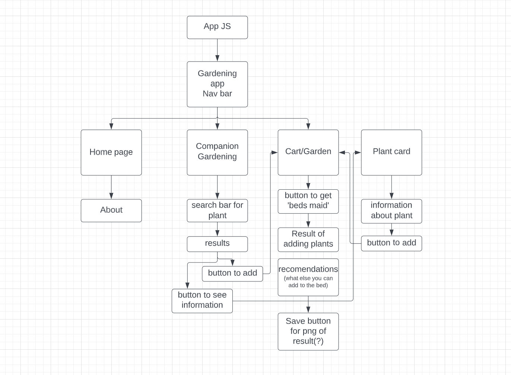
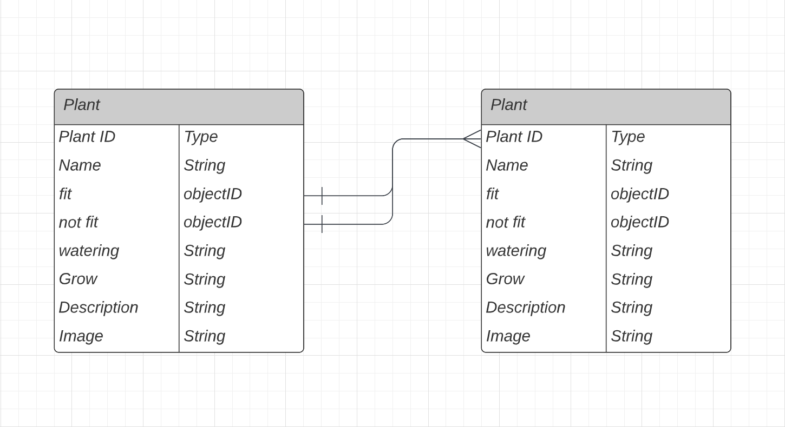

# Your-Garden

### App that makes your gardening decisions easier

## [Trello](https://trello.com/invite/b/W2bjDX2D/064d3f31f488844262712c4c07b8bdb8/your-garden)

## About:

Gardening is easier than you think, specially with 'Your Garden' app,

- Has information about most popular herbs, vegetables and berries you want to see in your garden.
- Companion planting never been easier, choose your plants and get garden bed chart made for you !

---

## Technologies

- Mongoose
- Express
- React
- Node.Js

---

## Diagrams:

Component Hierarchy

Entity Relationship

---

## MVP

- Landing page that gives you information about app
- Nav bar that takes you to the 'Companion gardening' or you chosen plants(cart)
- 'Companion gardening' page will have search bar to look for a plant, after your search you will be able to see plant that you were loking for and go to the plant page or add to the cart button.
- Every plant will have it's own information page with button 'add to garden'
- 'Your garden page' - cart, you will be able to look at your chosen plants and make garden chart based on companion planting database.

---

## Post MVP

- Register/Login page
- Be able to message about what plants would they like to see and what would you add to information suggestions
- Save your gardening chart to your page
- Leave posts with pictures on there page
